# TEST CASE POSITIVE

## 10 Test Case Positive

| ID Test Case | Kategori | Skenario Pengujian | Test Data | Expected Result | Actual Result | Status | Bukti (Screenshot) |
|-------------|----------|-------------------|------------|----------------|--------------|--------|-------------------|
| TC-P-01 | Positive | Login dengan data valid | Username: staff1@pharmaflow.local   Password: password123 | Staff berhasil masuk ke dashboard | Masuk ke halaman dashboard | PASS | 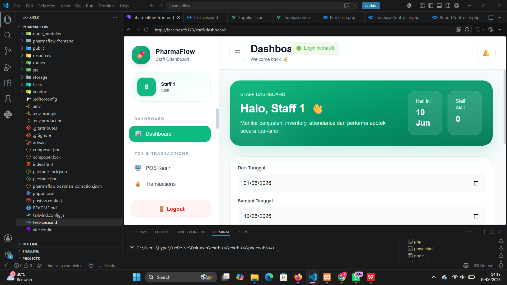 |
| TC-P-02 | Positive | Daftar akun baru | Username: asepganteng123@gmail.com   Password: password123 | User berhasil daftar dan diarahkan ke halaman login | Registrasi berhasil dan masuk ke halaman login | PASS | 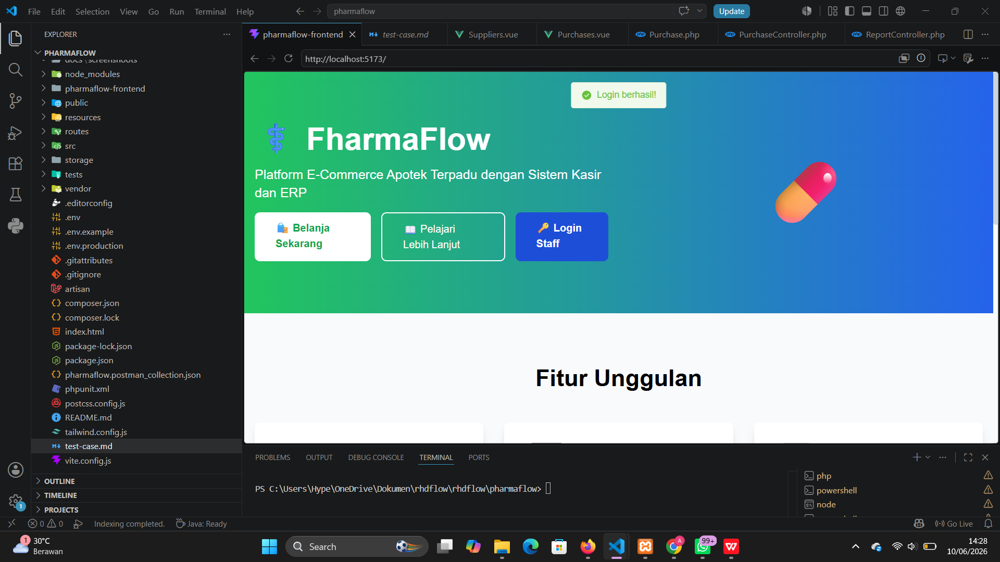 |
| TC-P-03 | Positive | Menambahkan obat | Nama: XimogXilin   Harga: Rp10.000 | Data berhasil tersimpan dan muncul di daftar menu | Data muncul pada menu input pesanan | PASS | 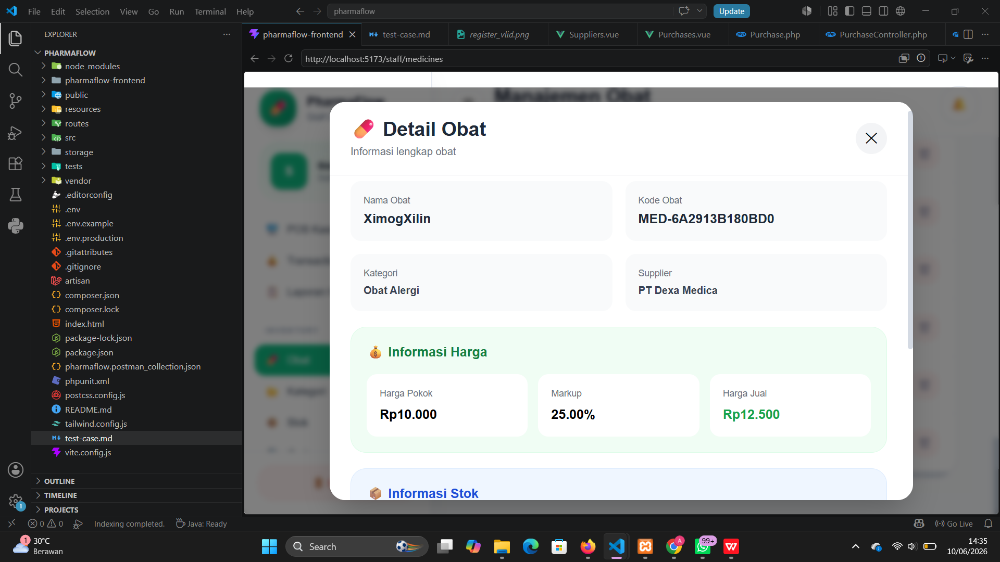|
| TC-P-04 | Positive | Menambahkan kategori obat | Nama Kategori: Obat Ganteng | Kategori berhasil disimpan | Kategori berhasil tampil | PASS | 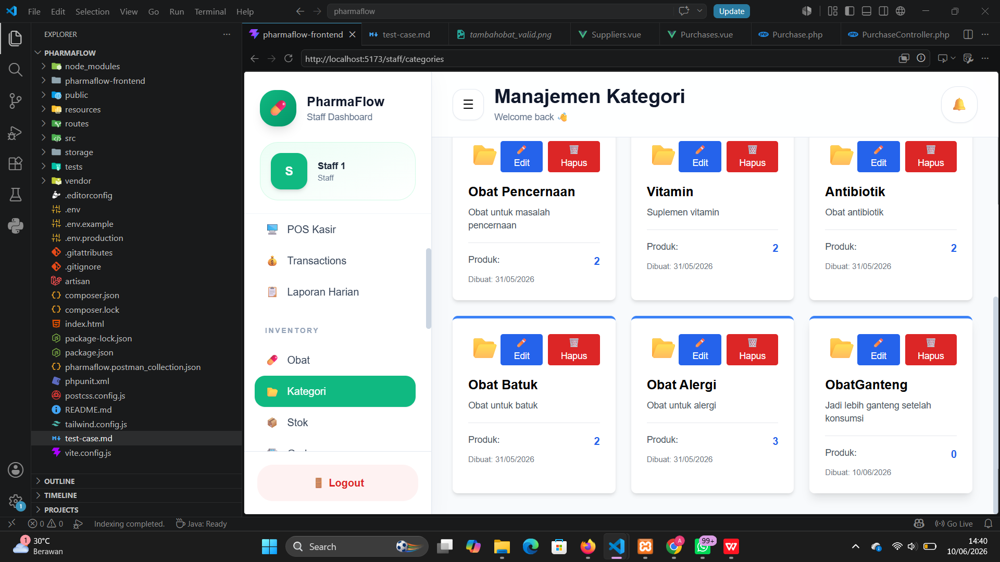 |
| TC-P-05 | Positive | Menambahkan Stock Obat | M: Stock Paracetamol | Stock Obat berhasil ditambahkan | Stock Obat tampil di daftar stock | PASS | 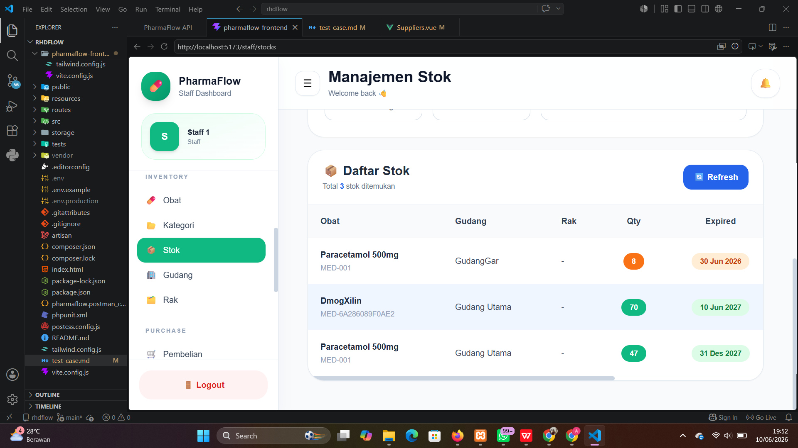 |

---

# TEST CASE NEGATIVE

## 10 Test Case Negative

| ID Test Case | Kategori | Skenario Pengujian | Test Data | Expected Result | Actual Result | Status | Bukti (Screenshot) |
|-------------|----------|-------------------|------------|----------------|--------------|--------|-------------------|
| TC-N-01 | Negative | Harga bernilai negatif | Harga: -10000 | Sistem menolak input | Pesan validasi muncul | PASS | 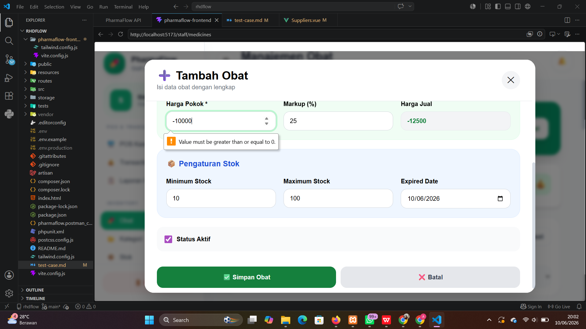 |
| TC-N-02 | Negative | Login dengan field kosong | Username: -   Password: - | Validasi gagal dan pesan error muncul | Sistem meminta mengisi semua field | PASS |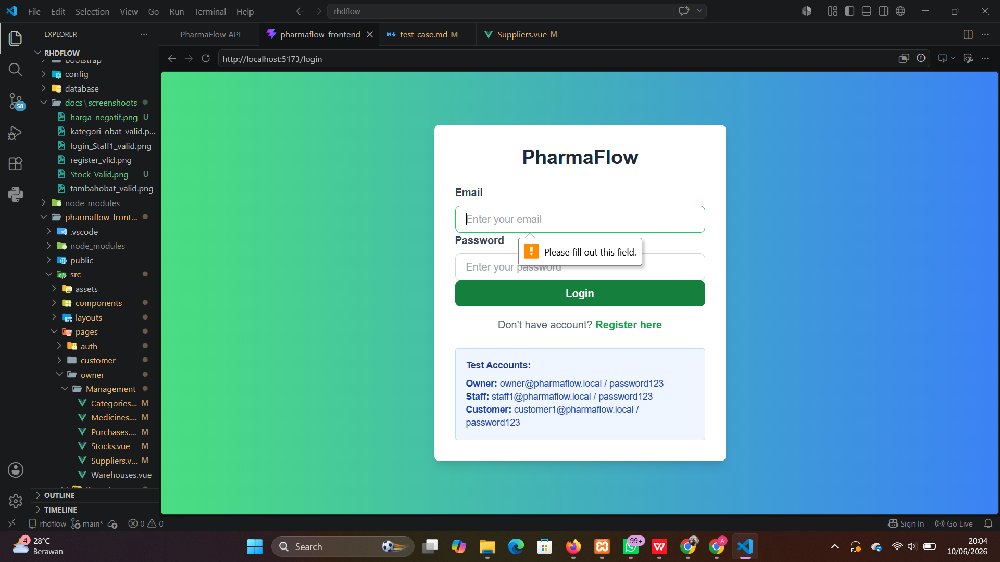 |
| TC-N-03 | Negative | Input harga menggunakan huruf | Harga: "rafli mahal" | Sistem menolak input | Field harga tidak ada | PASS | 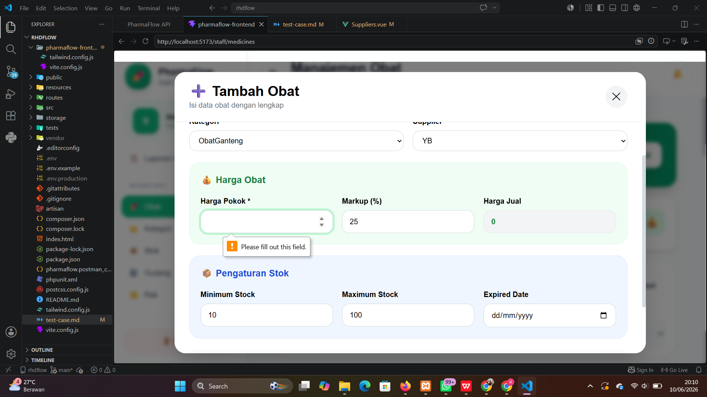.png |
| TC-N-04 | Negative | Username sudah digunakan | Username: owner | Registrasi ditolak | Pesan username sudah digunakan muncul | PASS | ! [Email has ready taken](docs/screenshoots/duplikat.png) |
| TC-N-05 | Negative | Password kurang dari 6 karakter | Password: 1 | Sistem menolak input | Validasi password gagal | PASS | 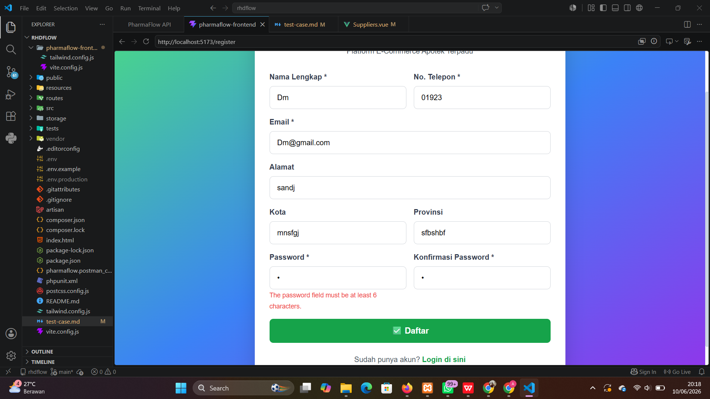 |

---

# TEST CASE EDGE

## 10 Test Case Edge

| ID Test Case | Kategori | Skenario Pengujian | Test Data | Expected Result | Actual Result | Status | Bukti (Screenshot) |
|-------------|----------|-------------------|------------|----------------|--------------|--------|-------------------|
| TC-E-01 | Edge | Input nama dengan spasi berlebih | Nama: "Owner        @pharmaflow.local" | Sistem menormalkan spasi atau menolak input | Sistem menerima tetapi tidak menormalkan spasi | FAIL | 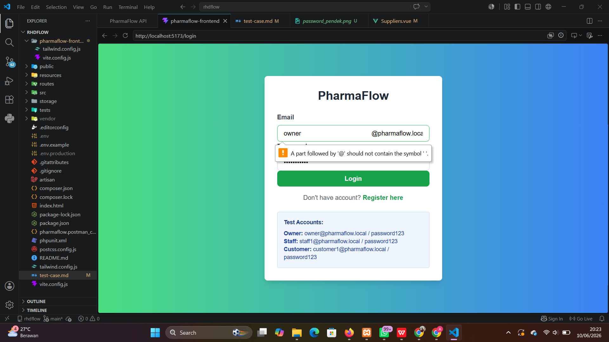 |
| TC-E-02 | Edge | Input karakter Unicode | Nama: Dmog😎 | Sistem menangani karakter khusus | Data tersimpan | PASS | 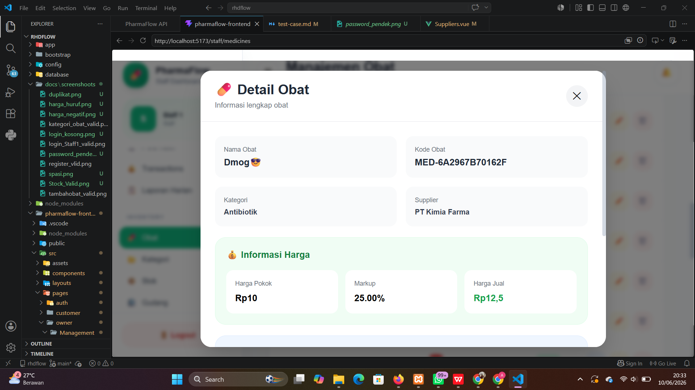 |
| TC-E-03 | Edge | Password tepat batas minimum | 123456 | Sistem menerima input | Registrasi berhasil | PASS | 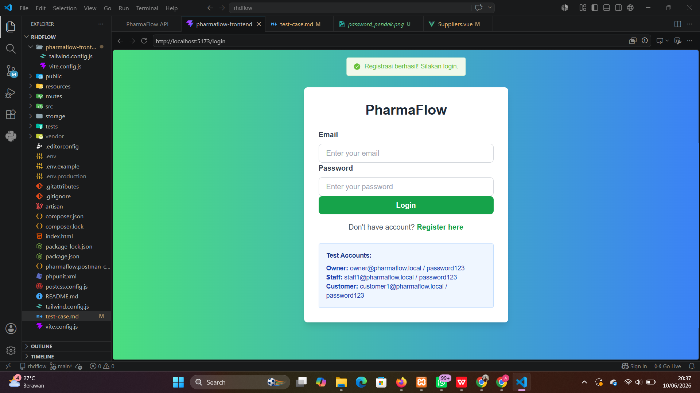 |
| TC-E-04 | Edge | Harga = 0 | Harga: 0 | Sistem tidak menolak atau memberi peringatan | Validasi berjalan | PASS | 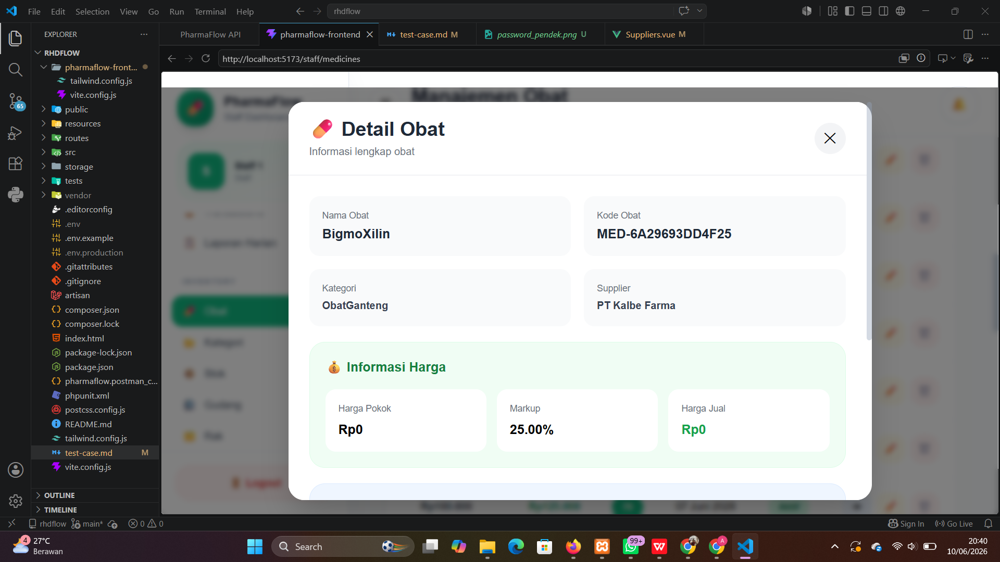 |
| TC-E-05 | Edge | Input harga maksimum integer | Harga: 214748364787381283678624 | Sistem menerima jika masih dalam batas | Data Tidak tersimpan | PASS |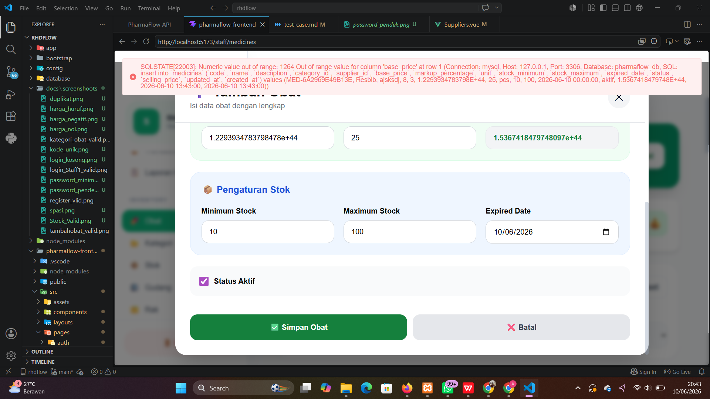 |
